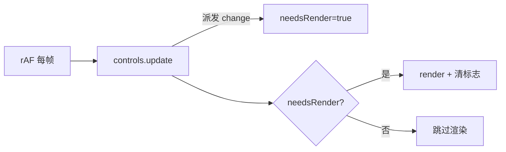

## 产品概述

对已有的 3D 立方体交互可视化工具进行性能与交互细节修复，不改变现有功能与界面布局。

## 核心功能

- 性能优化：降低运行时 CPU 占用。当前即使场景静止也每帧无条件渲染，且不透明度拖动等操作会触发着色器反复重编译；需改为按需渲染并消除冗余重编译，缓解随对象增多而上升的开销。
- 视角锁定解除：修复多次点击后拖拽"卡死"导致不按住按键移动鼠标视角仍持续旋转的问题，并提供指令（Escape）强制解除锁定。
- 图层严格隔离：使用图层分离（整层平移）后，仅当前活动图层的立方体可被点击选中；点击其他图层立方体视为未命中并取消选中，操作不再跨层。

## 技术栈

- 沿用现有栈：three@^0.161.0 + TypeScript + Vite，无新增依赖。
- 修改集中在 `src/scene/Viewer.ts`、`src/scene/CubeFactory.ts`、`src/main.ts` 三个文件。

## 实现方案

### 1. 性能：按需渲染（最大收益）

当前 `Viewer.start()`（Viewer.ts:98-112）每帧无条件执行 `controls.update()` + `renderer.render()`，即使场景完全静止，这是空闲 CPU 高占用的主因。

改为脏标志驱动：

- 新增 `private needsRender = true` 与公开 `requestRender()`。
- 构造器中 `controls.addEventListener('change', () => this.needsRender = true)`（相机移动时置脏）。
- 循环改为：每帧仍调用 `controls.update()`（极廉价的数学运算，且驱动阻尼），但仅当 `needsRender` 为真时才 `renderHook?.()` + `renderer.render()`，随后清标志。
- 阻尼惯性自然兼容：拖拽/松手后 `update()` 持续派发 `change` → 持续渲染；阻尼收敛后不再派发 → 停止渲染，空闲 CPU 趋近于零。



外部所有视觉变更处需调用 `viewer.requestRender()`（见目录结构说明）。

### 2. 性能：消除冗余着色器重编译

`applyLayerStyle`（CubeFactory.ts:127-140）每次都对 6 个材质置 `m.needsUpdate = true`，会触发着色器重编译。该函数经 `syncLayer` 在不透明度滑块拖动（setOpacity, commit=false）时高频触发，造成拖动期间持续重编译。改为仅在 `transparent` 状态真正翻转（opacity 跨越 1↔<1 边界）时才置 `needsUpdate`；`opacity` 本身是 uniform，无需重编译即可每帧生效。

### 3. 性能：渲染器配置

- `preserveDrawingBuffer: true`（Viewer.ts:34-38）在部分浏览器强制非快速路径。`takeScreenshot()` 已在 `toDataURL` 前同步调用 `render()`（Viewer.ts:124-127），因此可安全改为 `false`，省去常态性能税。
- `setPixelRatio(Math.min(devicePixelRatio, 2))`（Viewer.ts:39）在高 DPI 下为 2，片元开销翻倍；下调上限至 1.5，显著降低填充率开销（视觉折衷可接受）。

### 4. 交互：视角锁定根因与解除

根因（已核实 OrbitControls r161 源码 node_modules/three/.../OrbitControls.js）：pointerdown 时 `domElement.setPointerCapture` 并在 domElement 挂 `pointermove`/`pointerup`（行1005-1012）；当浏览器隐式释放指针捕获（`lostpointercapture`，非 pointerup/pointercancel），OrbitControls 收不到 pointerup，`pointers` 数组与内部 `state` 未清空，`pointermove` 监听仍挂在 canvas → 之后任意鼠标移动都触发旋转，即"锁定"。

注意：`onPointerUp` 内 `releasePointerCapture`（行1054）在捕获已丢失时可能抛 `InvalidPointerIdError`，且抛出点在 `removeEventListener`（行1056-1057）之前，导致合成 pointerup 既不可靠又会残留监听。因此不采用合成事件，改用**重建控制器**：

- 新增 `resetInteraction()`：保存 `controls.target`，`controls.dispose()`（dispose 会移除残留的 pointermove/pointerup，行419-425），再 `new OrbitControls`，恢复 target / enableDamping / dampingFactor，重挂 `change` 监听。彻底清空内部状态。
- 自动恢复：追踪 `pointerDown`（canvas pointerdown 置真，controls `end` 事件置假）；canvas `lostpointercapture` 触发时若 `pointerDown` 仍为真（说明 `end` 未派发＝卡死），自动调用 `resetInteraction()`。
- 手动指令：`main.ts` 绑定 Escape → `viewer.resetInteraction()`（与现有 Ctrl+Z/Y 同处，注意输入框聚焦时不触发）。
- `controls` 字段由 `readonly` 改为可变以支持重建（main.ts 不直接持有该引用，安全）。

### 5. 交互：图层严格隔离

`pickableCubes()`（main.ts:62-64）当前仅按可见性过滤。改为仅返回活动图层中可见的立方体：`cubes.filter(c => c.layerId === activeLayerId && layerVisible(c.layerId))`。`Picker.pick` 仅对传入集合做射线相交，故选中自然限于活动层；所有操作均作用于 `selected`，隔离自动成立。

需同步在活动层变更处调用 `refreshPicker()`：当前 `selectLayer`（main.ts:294-297）只设 `activeLayerId` + `layerPanel.refresh()`，未刷新 picker；`addLayer`/`deleteLayer` 同理需补。切换活动层后若当前 `selected` 不属于新活动层，则 `deselect()`。更新底部提示文案说明隔离规则。

## 实现备注

- 按需渲染的脏标志接入点是关键：遗漏会导致视觉变更不即时显示。已通过 `History.onChange`（History.ts:38/46/54/68 在 push/undo/redo/clear 后均触发）统一覆盖所有走历史栈的动作；仅 `select/deselect/syncCube/applyLayerOrders/unregister/onResize` 需显式 `requestRender()`。
- `controls.update()` 保留每帧调用以驱动阻尼，开销可忽略；如需进一步降空闲 CPU，可在长时间无 `change` 时暂停 rAF 并于 `requestRender`/`change` 重启（本次不做，避免复杂度）。
- 重建控制器为低频操作（仅 Escape 或丢失捕获时），构造开销可忽略。
- 保持向后兼容：不改公开 API 语义，仅新增 `requestRender()`/`resetInteraction()`，`start(renderHook?)` 签名不变。

## 架构设计

维持现有分层（scene / draw / model / ui / core），不引入新模式：

- `Viewer` 负责渲染调度与控制器生命周期（新增按需渲染 + 控制器重建）。
- `main.ts` 作为编排层，在视觉变更 choke point 与输入指令处调用 Viewer 新接口；图层可拾取集合由 `pickableCubes` 收口。
- `CubeFactory` 负责材质/几何细节优化。
- `History` 复用现有 `onChange` 钩子驱动重渲染，零侵入。

## 目录结构

```
src/
├── scene/
│   └── Viewer.ts        # [MODIFY] 按需渲染(needsRender/requestRender/controls change/循环门控)；preserveDrawingBuffer=false、pixelRatio≤1.5、onResize 触发 requestRender；resetInteraction()(dispose+重建保留 target/阻尼)、lostpointercapture 自动恢复、controls 改可变
├── scene/
│   └── CubeFactory.ts   # [MODIFY] applyLayerStyle 仅在 transparent 翻转时置 needsUpdate；可选共享 BoxGeometry
└── main.ts              # [MODIFY] 接入 requestRender(syncCube/applyLayerOrders/unregister/select/deselect) + History.onChange 触发 requestRender + Escape→resetInteraction；pickableCubes 限活动层、selectLayer/addLayer/deleteLayer 调 refreshPicker、跨层选中取消、更新提示文案
```

（`Picker.ts` 无需改动，拾取隔离通过传入集合实现。）

## 关键代码结构

```ts
// Viewer.ts 新增/变更（接口级）
export class Viewer {
  private needsRender = true;
  private pointerDown = false;
  controls: OrbitControls; // 由 readonly 改可变
  requestRender(): void;            // 外部视觉变更后调用
  resetInteraction(): void;         // Escape/lostpointercapture 时强制释放卡死拖拽
  // start() 循环：controls.update() 后仅 needsRender 时 render
}
```

```ts
// main.ts
function pickableCubes(): Cube[] {
  return cubes.filter(c => c.layerId === activeLayerId && layerVisible(c.layerId));
}
// History 构造回调同时触发 toolbar.setHistory 与 viewer.requestRender()
```