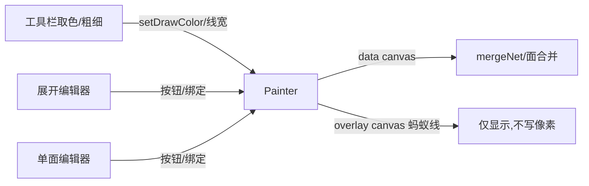

## 用户需求

在立方体「单面编辑器」与「平面展开编辑器」的绘图中，参考常见平面绘画软件补齐基础绘制功能，重点实现「油漆桶（选定区域内上色）」，并加入橡皮擦。

## 产品概述

在现有 Painter 绘制核心之上，引入「选区 → 填充」两步式工作流及橡皮擦工具，使两个编辑器都具备封闭区域上色与擦除能力，体验对齐主流绘图软件。

## 核心功能

- **三种选区工具**：矩形选区、椭圆（圆心/包围盒）选区、自由套索选区；拖拽生成封闭区域，以动态蚂蚁线可视化。
- **油漆桶填充**：在已选区域内填充当前绘制色；无选区时填充整张画布（选区经 `clip` 限制，绝不越界污染其他面）。
- **橡皮擦**：自由拖拽擦除为透明（`destination-out`），可调节粗细。
- **绘制色贯通**：工具栏既有色板/自定义色同时驱动绘制色，供填充与橡皮使用。
- **粗细调节**：线段/矩形/圆描边与橡皮尺寸共用一个粗细滑块。
- **一致性**：上述能力同时作用于展开编辑器与单面编辑器，且旋转/镜像视图下选区与填充坐标仍精确对齐。

## 技术栈

- 沿用现有项目栈：Vanilla TypeScript + Vite 6 + Canvas 2D，无新增依赖（保持部署友好）。
- 不引入框架；UI 仍为原生 DOM + Canvas。

## 实现方案

### 总体策略

以 `Painter` 为唯一绘制核心，扩展其能力，两个编辑器仅新增按钮与事件绑定，复用同一套 `Painter` 方法，避免逻辑分叉。选区与预览全部绘制在**独立覆盖层 canvas** 上，数据 canvas（即 `face.canvas` 与展开 `netCanvas` 像素缓冲）保持纯净，确保 `mergeNet` / 面合并逻辑零影响。

### 关键技术决策

1. **绘制色共享状态**：在 `Painter.ts` 模块级导出 `setDrawColor/getDrawColor`（默认 `#1f6feb`），替代原 `styleStroke` 硬编码蓝色。工具栏取色控件在调用 `actions.setColor`（立方体底色）的同时调用 `actions.setDrawColor` → `setDrawColor(hex)`。绘制时 `Painter` 实时读取共享值，编辑器打开后改色即时生效，无需持有跨模块引用，改动最小。
2. **覆盖层 canvas（蚂蚁线）**：`begin()` 中创建与 data canvas 同像素尺寸、作为兄弟节点的 `.painter-overlay`（`pointer-events:none`）。选区轮廓用 `requestAnimationFrame` 驱动 `lineDashOffset` 实现经典蚂蚁线；`end()` 时移除覆盖层并 `cancelAnimationFrame`，杜绝内存/CPU 泄漏。
3. **选区几何模型**：`Selection = {kind:'rect'|'ellipse', x,y,w,h} | {kind:'free', points[]}`。拖拽期间在覆盖层预览，释放后定稿并启动蚂蚁线。
4. **填充（油漆桶）**：`fill()` 在 `base` 上下文 `save → buildPath(clip) → fillRect(包围盒) → restore`，再同步到显示 canvas。受 `clip` 约束，仅填充选区内；无选区则填整张。
5. **橡皮擦**：自由拖拽，`globalCompositeOperation='destination-out'`，粗细取线宽；增量笔画每帧由 `base` 重绘预览，释放提交进 `base`。
6. **视图对齐**：新增 `Painter.setViewTransform(css)`，对 data canvas 与 overlay 同时设置 `transform` + `transform-origin:center`；`NetEditor.applyView` 改调此方法，保证旋转/镜像下蚂蚁线与绘制坐标一致（`pos()` 逆映射逻辑不变）。
7. **边界清理**：`rotateContent()` 与 `importImage()` 会改动/覆盖像素，内部先 `clearSelection()`，避免覆盖层与像素错位。

### 性能与可靠性

- 自由笔/橡皮每帧从 `base` 重绘整笔，复杂度 O(笔画点数)，面尺寸 ≤ 数百像素、展开 ≤ 数千像素，开销可接受。
- 蚂蚁线 rAF 仅在 `begin()` 后运行，`end()` 必停；覆盖层不拦截指针事件。
- 选区/预览均不写 data canvas，merge 结果可验证不受污染。

## 实现注意事项

- 保持 `pos()`、`begin/end/restore`、`rotateContent`、`importImage`、`setText` 既有行为不变。
- `NetEditor` / `FaceEditor` 中 `[data-tool]` 类型断言由 `'line'|...` 拓宽为 `DrawTool`，并新增 `data-action="clear-sel"` 与粗细 `data-role="width"` 绑定。
- 覆盖层插入到 `.canvas-wrap` 内、data canvas 之后；`.canvas-wrap` 需 `position:relative`，覆盖层 `position:absolute;inset:0;width:100%;height:100%` 以匹配各自 max 缩放。
- 仅在编辑器内修改 UI，不触碰全局 `History` 命令栈（canvas 像素级撤销过重，标注为后续可选增强）。

## 架构设计



## 目录结构

```
src/
├── draw/
│   ├── Painter.ts        # [MODIFY] 扩展 DrawTool 联合类型；新增模块级绘制色 setDrawColor/getDrawColor；
│   │                    #   新增覆盖层 canvas 与蚂蚁线 rAF；新增 Selection 类型与选区几何；
│   │                    #   实现 fill()、eraser 自由笔、clearSelection()、setLineWidth()、setViewTransform()；
│   │                    #   重构 handleDown/Move/Up 按工具分支；rotateContent/importImage 内清选区。
│   ├── NetEditor.ts      # [MODIFY] .tools 新增 矩形/椭圆/套索选区、填充、橡皮擦、取消选区 按钮与粗细滑块；
│   │                    #   绑定新工具与动作；applyView 改调 painter.setViewTransform 同步覆盖层。
│   └── FaceEditor.ts     # [MODIFY] 同 NetEditor 同步新增选区/填充/橡皮/取消选区按钮与粗细滑块及绑定。
├── ui/
│   └── Toolbar.ts        # [MODIFY] 色板/自定义色在调用 actions.setColor 同时调用 actions.setDrawColor；
│   │                    #   接口补充 setDrawColor。
├── main.ts               # [MODIFY] 实现 setDrawColor action，转发至 Painter.setDrawColor（绘制色共享）。
└── style.css             # [MODIFY] 新增 .canvas-wrap{position:relative}；.painter-overlay 定位/缩放；
                          #   选区/填充/橡皮按钮与激活态、粗细滑块样式（沿用既有深色主题）。
```

## 关键代码结构

```ts
// Painter.ts 类型与对外 API（仅签名，不实现）
export type DrawTool =
  | 'line' | 'rect' | 'circle' | 'text' | 'image'
  | 'select-rect' | 'select-ellipse' | 'select-free'
  | 'fill' | 'eraser';

export type Selection =
  | { kind: 'rect'; x: number; y: number; w: number; h: number }
  | { kind: 'ellipse'; x: number; y: number; w: number; h: number }
  | { kind: 'free'; points: { x: number; y: number }[] };

export function setDrawColor(hex: string): void;
export function getDrawColor(): string;

// Painter 类新增方法
// setLineWidth(w: number): void
// clearSelection(): void
// fill(): void
// setViewTransform(css: string): void
// get overlayCanvas(): HTMLCanvasElement | null
```

## 设计风格

在既有深色工具栏/覆盖层风格上延伸，新增工具按钮与选区交互需保持简洁一致：按钮沿用 `.btn` 体系（激活态高亮），新增「粗细」滑块与「取消选区」按钮。展开/单面画布上方叠加一层透明蚂蚁线覆盖层，拖拽选区时以虚线预览，释放后以黑白双描边蚂蚁线动画提示已选区域；旋转/镜像视图下覆盖层与画布同步变换，视觉完全对齐。

## 页面区块（编辑器工具行）

- **选区工具组**：矩形选区、椭圆选区、套索三个按钮，点击激活后进入拖拽选区模式。
- **油漆桶填充**：激活工具后单击即在当前选区内上色（无选区填整张）。
- **橡皮擦**：自由擦除，粗细由滑块控制。
- **取消选区**：一键清除当前选区与蚂蚁线。
- **粗细滑块**：1–40px，联动描边与橡皮尺寸，带数值提示。