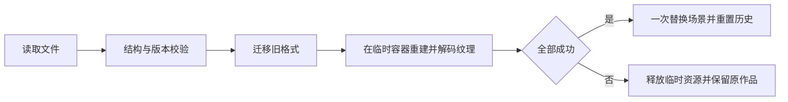
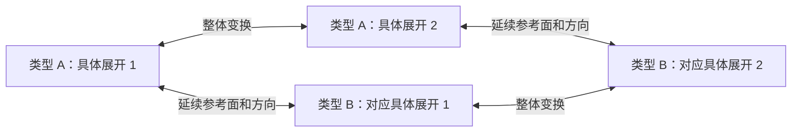
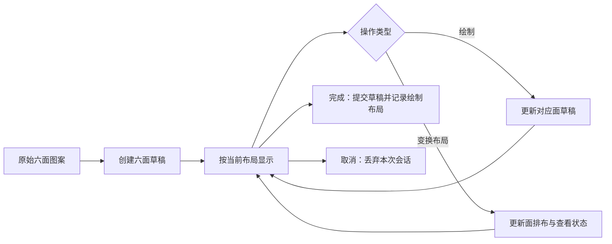

# 三维几何可视化工具：现状分析与改进建议

> 分析日期：2026-10-04
>
> 代码基线：`c134dad`（`add more UI`）
>
> 目标：帮助使用者理解立体图形、不同观察方向的视图，以及立体表面和平面展开图之间的关系。

## 1. 核心结论

项目已经有可继续发展的基础：立方体堆叠、图层变换、面绘制、展开图生成、撤销重做和文件保存均已实现。但当前体验更接近一个立方体编辑器，学习者仍需自行推断“从哪个方向看”“这个面在展开图哪里”“折叠后图案朝哪边”等关键关系。

建议按以下顺序改进：

1. **先让操作结果可信。** 修复依视角旋转错误、取消不能回滚、模板切换丢失绘制、导入失败破坏场景等问题。对教学工具来说，错误结果会被使用者误认为几何规律。
2. **支持等价具体展开之间的整体变换，并保留展开编辑的连续性。** 在不改变六面体图案关系的前提下，切换同类型的具体展开，以及不同类型之间相互对应的具体展开；提供回到绘制布局，再增加标准视图、面边联动与折叠演示。
3. **形成学习闭环。** 从“自由操作”扩展到“先预测—再验证—解释差异”，加入少量精选例题、答案反馈和适合分享的图像导出。

第一阶段宜聚焦两条能力：**单位立方体组合的视图理解**、**单个正方体的展开与图案方向判断**。长方体、任意组合体展开、柱锥和曲面展开应分阶段引入；这些对象需要不同的几何约束，不能仅增加几个模型按钮。

### 1.1 分析依据与边界

本次阅读了全部 `src` 代码、构建配置，并参考了 `.codebuddy/plans` 中的历史方案。历史方案只作为背景，是否已经实现以当前代码为准。

文中证据分为四类：

| 标记 | 含义 |
| --- | --- |
| 运行核查 | 已执行构建或直接调用现有几何函数检查 |
| 代码确认 | 可以从当前事件和数据流确定的问题；提供触发路径，尚未逐项进行浏览器点击复现 |
| 设计建议 | 基于本工具教学目标提出的新能力或规则 |
| 待实测 | 需要浏览器、真实设备或用户任务验证的体验与性能问题 |

**本次未开展浏览器视觉验收、移动设备测试或用户实验。** 因此不把卡顿程度、具体界面遮挡尺寸、学习效果等推测写成实测结论。文中的性能指标是建议验收目标，并非当前成绩。

### 1.2 已执行的核查

| 检查 | 结果 | 结论边界 |
| --- | --- | --- |
| `npm run build` | 通过 TypeScript 检查与 Vite 构建 | 只证明可构建，不能证明交互正确 |
| 构建体积 | 主 JS 531.80 kB，gzip 137.64 kB；触发 500 kB 分块提示 | 属于加载优化线索，不等于已证实运行卡顿 |
| 展开图数量与形状去重 | 11 个模板；在平移、旋转、镜像等价下仍为 11 个不同形状 | 对无标记正方体展开图的形状分类成立 |
| 独立折回检查 | 11 个模板均有 6 个不同面、6 个不同格，连通且折回得到 6 个不同法线 | 检查基于二维格邻接重新折回，没有直接复用生成器的 `foldCheck` |
| 展开面方向 | 从 `THREE.BoxGeometry` 的实际顶点与 UV 推导面坐标，66 个面映射均匹配 | 验证了模板的面归属与方向；尚未验证浏览器像素往返、透明像素和 CSS 变换 |
| 整数轴旋转 | 24 种正方体姿态上，144 项“四次 90° / 正反旋转”检查通过 | 对 `rotateByAxis` 的世界 X/Y/Z 轴操作成立 |
| 图层坐标往返 | 24 种姿态 × 3 个整数点，共 72 项通过 | 当前单位网格、90° 旋转约束下成立 |
| 依视角旋转 | 默认相机方向下，正反操作不能互相抵消 | 需要优先修复，详见 B01 |
| 非原点旋转中心预览 | 预览位置与实际提交位置不同 | 详见 B07 |

这些结果说明：**展开模板生成与整数图层变换可以保留，主要问题集中在操作语义、编辑状态和教学表达。**

## 2. 当前能力与目标之间的差距

| 领域 | 当前已有 | 当前限制 | 改进方向 |
| --- | --- | --- | --- |
| 三维观察 | 透视相机、自由旋转、缩放、轨道控制异常恢复 | 无标准六向视图、正交切换、视角复位、自动取景 | 让观察方向可选择、可命名、可复现 |
| 三视图理解 | 可以手动旋转观察组合体 | 无同步正视、俯视、侧视图；透视图不能直接作为标准正投影 | 增加统一比例的正交投影视窗与投影轮廓 |
| 几何编辑 | 添加、贴面堆叠、删除、单体旋转 | 缺少格占用检查；没有清晰的选中面标识 | 保证一个格一个实体，明确操作对象和方向 |
| 图层 | 平移、旋转、显隐、透明度、排序、合并、旋转中心 | 变换预览、透明度历史、选择状态和列表刷新不一致 | 完善状态一致性，向普通使用者解释为“组件组” |
| 单面绘制 | 图形、文字、图片、选区、填充、擦除、旋转内容 | 取消行为错误；无笔画级撤销；色彩与材质混合 | 独立草稿、局部历史、明确的背景与图案颜色 |
| 平面展开 | 11 种正方体展开图、纹理方向映射、编辑后回写六面 | 每次打开重置模板与查看方向；每种形状仅有一个具体展开代表；缺少同类型和跨类型的整体变换 | 保留每类的具体展开状态及其对应关系，记住绘制布局，再展示折叠过程 |
| 保存与复用 | JSON 保存、读取、三维画布 PNG 截图 | 缺少输入校验、失败恢复、自动保存和教学版导出 | 保存过程可靠，作品可以再次打开和用于讲解 |
| 学习反馈 | 底部操作提示 | 无任务、答案、错误解释或练习记录 | 提供短任务与可核对的几何依据 |

## 3. 必须优先处理的实现问题

优先级定义：

- **P0：** 会产生错误几何结果、丢失编辑内容或破坏场景一致性，进入下一轮教学功能开发前处理。
- **P1：** 影响核心理解与日常操作，随第一轮教学能力一起完成。
- **P2：** 在正确性和核心学习流程稳定后处理的扩展与工程优化。

### B01 · P0 · “依视角旋转”不满足正反操作恢复原姿态

**证据：运行核查。** 入口位于 [main.ts](../src/main.ts) 的 `rotate`（约 698 行）；计算位于 [CubeFactory.ts](../src/scene/CubeFactory.ts) 的 `rotateWorldAxis`（约 215 行）。

当前实现取相机的屏幕上方向或右方向作为任意三维轴，旋转 90° 后，再将结果欧拉角的三个分量分别四舍五入到 90° 的倍数。这种取整不等价于在正方体的 24 种有效姿态之间旋转。

使用现有函数、相机位置 `(6,6,8)`、观察目标 `(0,2,0)`，得到以下结果：

| 操作 | `cube.rotation` |
| --- | --- |
| 初始姿态 | `(0,0,0)` |
| 绕屏幕上方向 +90°，对应“左转” | `(0,90,-90)` |
| 再绕相同方向 −90°，对应“右转” | `(0,0,-90)` |

最终相对原姿态仍有旋转。无图案的正方体外形可能看不出变化，带箭头或文字的面会暴露错误，尤其容易误导空间推理。

此外，`cube.rotation` 是图层本地姿态，入口却直接传入世界坐标的屏幕轴。图层已旋转时，还缺少世界轴转为图层本地轴的步骤。独立例子：图层绕 Z 轴 90° 后，对单体施加世界 Y 轴 90° 旋转，现有组合结果与目标世界姿态相差约 120°。

**建议：**

1. 首先提供语义明确的“绕世界 X/Y/Z 轴 ±90°”操作；旋转前突出显示轴与方向。
2. 若保留“左转/上翻”，先将屏幕意图映射到一个明确的有符号世界主轴，并在界面显示该轴。轴选择应由相机决定，避免随单体姿态跳变。
3. 在世界空间计算目标姿态，再转换为本地姿态：`QlocalNew = inverse(Qlayer) × QdeltaWorld × Qlayer × Qlocal`。
4. 用四元数或 24 种立方体姿态索引管理旋转；只在显示时转换欧拉角。

**验收：** 24 种初始姿态、不同相机方向及不同图层姿态下，正反操作恢复原姿态，连续四次同轴 90° 恢复原姿态；六面上的非对称图案随物体正确移动。

### B02 · P0 · 单面编辑“取消”没有恢复打开前的内容

**证据：代码确认。** [FaceEditor.ts](../src/draw/FaceEditor.ts) 的 `open` 直接使用原始 `face.canvas`；[Painter.ts](../src/draw/Painter.ts) 的 `handleUp`、`fill`、`commitText` 等不断修改 `base`，而 `restore` 仅复制这个已经变化的 `base`。

**触发路径：** 打开单面编辑 → 完成一笔或填充 → 点击取消 → 重新打开该面或保存场景。已完成的绘制仍存在。三维纹理没有立即请求更新时，画面可能暂时保持旧样子，但保存读取的是已修改的 canvas。

**建议：** 编辑器使用独立草稿画布。打开前快照不可修改；“完成”统一提交草稿并产生一条场景历史，“取消”直接丢弃草稿。不要让预览、笔画基线与取消快照共用同一个变量。

**验收：** 线条、填充、文字、擦除、导图、旋转内容之后取消，六面数据与打开前一致，保存再读取也一致；取消不新增场景历史。

### B03 · P0 · 展开模板切换会无提示丢失当前绘制

**证据：代码确认。** [NetEditor.ts](../src/draw/NetEditor.ts) 83–89 行附近的模板切换事件直接调用 `renderNet(cube, tpl, netCanvas)`，从原立方体重建画布，未保存展开画布里的新内容。

**触发路径：** 展开选中立方体 → 在某面画一个记号 → 切换模板 → 切回原模板。记号消失。

**建议：** 以六个独立的面草稿作为编辑数据，模板只决定布局。切换前将当前布局映射回面草稿，再按新模板渲染；只有点击完成才写入场景。用同一编辑会话保存模板、面标记和局部历史。

**验收：** 任意模板之间反复切换，六面的图案、方向和内容保持一致；切换不产生意外镜像；取消整次编辑仍能回到原场景。

### B04 · P0 · 模态编辑仍响应场景撤销，缺少局部历史

**证据：代码确认。** [main.ts](../src/main.ts) 923 行附近的快捷键仅排除 `INPUT`、`TEXTAREA`，未检查编辑器是否打开。`Painter` 没有笔画历史栈。

**触发路径：** 添加立方体 → 打开该立方体的面编辑 → 在画布或按钮获得焦点时按 Ctrl+Z。撤销的是场景中的添加等操作，而非刚才的笔画，编辑器仍持有原对象。Esc 也只重置相机交互，不会按模态语义关闭编辑器。

**建议：** 建立明确的输入上下文：场景观察、场景编辑、面编辑、展开编辑。快捷键交给当前上下文；编辑器内 Ctrl+Z 撤销局部笔画，Esc 丢弃或关闭草稿，完成时合并成一条场景命令。

**验收：** 在模态编辑中操作快捷键不会删除或旋转背景对象；完成后一次场景撤销可以还原整次面编辑。

### B05 · P0 · 导入缺少校验和原子替换，失败可能破坏当前作品

**证据：代码确认。** [serialize.ts](../src/model/serialize.ts) 的 `readSceneFile` 只做 `JSON.parse` 和类型断言；[main.ts](../src/main.ts) 的 `loadSceneFromFile` 在构建新对象前就清空旧场景；[CubeFactory.ts](../src/scene/CubeFactory.ts) 的 `loadImageToCanvas` 只有 `onload`，没有 `onerror`。

具体问题：

- 合法 JSON 若缺少 `cubes` 或对象字段错误，可能先清空原场景，再在重建中抛错。
- 一张无法解码的面图片会让加载 Promise 一直不结束，场景可能停在部分加载状态。
- 加载期间没有事务锁或会话编号，再次读取或编辑可能与异步导入交错。
- `version` 没有检查；`gridSize` 被保存，却未恢复到当前固定 `SIZE=1` 的环境。
- 图层关联、活动图层是否存在、坐标是否有限、旋转是否符合约束、透明度范围、ID 唯一性都没有校验。
- 新建立方体的计数器未像图层计数器一样对齐导入 ID。含高编号或稀疏编号的文件，后续可能生成重复的 `cube-N`。
- 导入的 `cube.id` 被插入 `NetEditor` 的 `innerHTML`。显示名称应通过 `textContent` 写入，避免文件内容被当作 HTML 解析。

**建议流程：**



第一版可明确仅接受统一单位大小和 90° 旋转，避免“格式接受、几何却不支持”的状态。图片加载应支持失败、取消与会话失效检查；导入期间显示进度并禁止会冲突的场景修改。

**验收：** 错误字段、重复 ID、未知版本、坏图片、无效图层引用均给出可读错误并保留旧场景；取消或连续导入不会产生混合结果；导入后新增对象的 ID 唯一。

### B06 · P0 · 贴面堆叠没有检查占用位置

**证据：代码确认。** [main.ts](../src/main.ts) 的 `attachStack` 算出坐标后直接 `createCube`、`register`。`freeGridPos` 则把所有图层的本地坐标放在同一个集合中判断占用。

前者允许在已有立方体的位置再次堆叠，例如将选中单体旋转到面朝已有相邻单体后再贴面添加；后者会被无关图层的本地坐标影响。两者使用的空间规则不一致。

重叠对象会影响选择、数量、颜色和后续投影判断。以后计算表面积或外表面展开时，重复实体还会使拓扑结果失真。

**建议：** 在当前约束下，以 `(layerId,x,y,z)` 建立占用索引，同层同格最多一个单体。添加、贴面、移动、导入、合并统一经过校验。跨层重叠可保留为演示能力，但要明确它是多个组件叠放；投影、计数、合并时分别定义处理规则。

**验收：** 被占用位置预览为不可放置；提交不新增重复对象；撤销重做保持索引一致；其他图层的本地坐标不影响活动层的空位查找。

### B07 · P1 · 旋转预览与实际旋转中心不一致

**证据：运行核查。** [main.ts](../src/main.ts) 的 `rotateLayer` 使用 `cBefore - cAfter` 补偿图层平移；`previewRotate` 没有这一步。

例子：图层初始姿态与平移均为零，旋转中心 `(1,0,0)`，单体本地位置 `(2,0,0)`，绕 Z 轴 +90°：

- 当前预览：`(0,2,0)`。
- 实际提交：`(1,1,0)`。

**建议：** 提取一个纯函数，计算“围绕指定中心旋转后的图层变换”。预览和提交使用同一个结果，只区分是否落盘和记录历史。

**验收：** 任意有效旋转中心、初始图层姿态和轴方向下，预览位置与提交位置逐项相同。

### B08 · P1 · “几何中心”实际是取整后的包围盒中心

**证据：代码确认。** [main.ts](../src/main.ts) 的 `centerToGeometry` 对各轴 `(min+max)/2` 使用 `Math.round`；[LayerPanel.ts](../src/ui/LayerPanel.ts) 的输入也强制取整。

两个单体中心分别位于 `x=0` 和 `x=1` 时，包围盒中心应为 `x=0.5`，当前得到 `x=1`。对不规则组合体，包围盒中心本来就不一定等于体积中心，名称还存在第二层歧义。

**建议：** 先明确“包围盒中心”“单体中心平均值”“网格枢轴”的区别。如果继续只支持整数网格枢轴，应直接改名并显示吸附后的坐标。若支持半格中心，需要验证指定轴的旋转是否仍落在合法网格，不能仅删除取整；例如某些长宽奇偶性不同的组合体绕半格中心 90° 后会落到半整数坐标。

**验收：** 使用者能看懂中心定义；标记与实际旋转轴一致；不兼容网格的旋转有明确处理规则。

### B09 · P1 · 不透明度拖动的撤销起点与控件生命周期错误

**证据：代码确认。** [LayerPanel.ts](../src/ui/LayerPanel.ts) 对滑块 `input` 调用即时更新，对 `change` 提交；[main.ts](../src/main.ts) 的 `setOpacity` 每次从已更新的 `l.opacity` 读取 `before`，且每个 `input` 都调用 `layerPanel.refresh()` 重建控件。

即使 `change` 正常到达，记录到的 `before` 也通常已是拖动终点，无法恢复开始时的值。原滑块在拖动中被移除，还可能中断指针和焦点，这部分需浏览器实测。

**建议：** 将连续交互拆成开始、预览、提交三个阶段。开始时捕获原值，拖动时只更新必要显示，结束时产生一条历史。颜色选择器也采用同样规则，避免 `input` 每变化一次就消耗一条历史。

**验收：** 从 100% 连续拖到 30%，一次撤销回到 100%，一次重做回到 30%；拖动期间不丢失焦点。

### B10 · P1 · 二维图案与三维表面缺少一致的颜色语义

**证据：代码确认。** [CubeFactory.ts](../src/scene/CubeFactory.ts) 的 `setCubeColor` 修改 `material.color`，渲染时会与整张贴图相乘；两个二维编辑器只显示原 canvas。主工具栏设置底色时还同时修改全局绘制色，编辑器内没有独立取色控件。

因此“统一底色，保留逐面绘制”实际会给图案整体染色：二维看到的文字或图案颜色与三维不同。橡皮用 `destination-out` 擦出透明像素，而普通不透明材质对这些像素的显示也未定义；展开画布铺白再回写还可能改变透明区域。

**建议：** 明确拆分面背景、图案内容和选中高亮。二维与三维共享同一最终合成图；底色只影响背景。用于颜色识别的教学模式可采用受光照影响小的材质，高亮采用轮廓，避免覆盖图案的原有颜色。

**验收：** 红蓝箭头、黑白文字、透明图片和擦除区域在二维、三维及保存读取后语义一致；编辑器内可以独立选择画笔色。

### 3.1 其他需要进入任务清单的问题

| 编号 / 优先级 | 证据与问题 | 建议与验收 |
| --- | --- | --- |
| B11 / P1 | 代码确认：`pickableCubes` 只检查活动层和 `visible`；透明度 0 仍可拾取。隐藏图层后没有清除已选对象，操作按钮仍可能作用于隐藏单体 | 明确可见、可拾取、已选择三个状态；隐藏后清理选择。透明辅助组件采用显式拾取开关 |
| B12 / P1 | 代码确认：拾取只对活动层射线检测，其他可见层不参与遮挡，可能点击前景组件却选到后面的活动层对象 | 保留已有图层隔离能力，提供“隔离活动组”显示；或按全部可见物体检测最近命中，再判断是否可编辑。穿透选择必须有明确提示 |
| B13 / P1 | 代码确认：`register/unregister` 不刷新图层面板，初始面板构建还早于初始单体注册；数量显示可能滞后 | 由统一状态通知更新计数；添加、删除、撤销、读取后列表数量立即正确 |
| B14 / P1 | 代码确认：只高亮整个单体，`selectedFace` 没有独立视觉标记；新建后默认选中 `px`；标题直接显示 `px/nz` 等内部名称 | 单独突出选中面，显示“面 A / 当前朝向右”；使用稳定面 ID 加动态空间朝向，避免物体旋转后标签混淆 |
| B15 / P1 | 代码确认：旋转与展开按钮没有纳入 `dependentButtons`，无选择时仍可点击但无效果 | 无选择时禁用并说明前提；工具状态反映实际可用性 |
| B16 / P1 | 代码确认：向下合并会直接丢弃同位置下层单体和六面内容，合并后套用目标图层显隐与透明度 | 预览冲突数量、被保留对象和合并后外观；保留撤销。操作说明不能仅写“合并” |
| B17 / P1 | 代码确认：`renderOrder` 被注释为“最上层”，但不透明物体仍受深度测试影响；透明物体又可能出现排序差异 | 明确列表排序和空间前后关系不同；不把三维组件顺序解释成二维遮盖顺序 |
| B18 / P1 | 代码确认及待实测：固定定位工具栏、右侧 268px 面板、360px 面画布，页面禁止整体滚动，缺少响应式断点与完整模态焦点管理 | 重排为有边界的工作区；模态限高并可滚动；支持触屏入口、键盘焦点、可访问名称。检查 390px、768px、1366px 宽度 |
| B19 / P2 | 代码确认：`Viewer.dispose` 不取消 rAF，也未统一释放辅助几何；`Painter` 无选区时仍每帧清空覆盖层 | 建立启停与资源所有权；只在需要时驱动动画。反复打开关闭编辑器及销毁查看器后资源回落 |
| B20 / P2 | 代码确认：图片导入强制拉伸铺满，缺少加载失败和关闭后回调保护；选择仅约束填充，未约束其他绘制；“圆”实际可绘出椭圆 | 提供等比适配与裁剪，异步回调校验编辑会话；说明选区作用范围；圆形约束或改名椭圆 |
| B21 / P1 | 代码确认及使用者明确需求：每种展开类型只留下一个具体展开代表，缺少保持六面体图案关系的整体变换；`NetEditor.open` 又重置了模板与查看方向 | 支持同类型的等价具体展开、跨类型的对应变换和“回到绘制布局”；完整规格见 5.1–5.3 |

## 4. 多角度视图：从自由旋转升级为可比较的几何表达

### 4.1 先区分“移动相机”和“旋转物体”

当前操作中，两种变化都表现为画面中的立方体转动，但教学含义不同：移动相机改变观察方向，旋转物体改变物体相对于坐标系的姿态。

建议将入口分开：

| 操作区 | 操作 | 反馈 |
| --- | --- | --- |
| 观察 | 正、后、左、右、上、下、等轴测、自由观察、复位、适应窗口 | 显示观察方向和相机模式；不进入物体编辑历史 |
| 物体 | 绕指定轴 ±90°、平移、选中组件 | 显示旋转轴、角度和目标预览；进入编辑历史 |
| 演示 | 播放某个变换过程、分步观察 | 可以暂停和回到起点；结束时姿态与几何结果一致 |

补充固定坐标轴和方向导航器。当前地面网格位于 `y=0`，初始单体也以 `y=0` 为中心，因此网格穿过单体中部。如果网格代表地面，应放到单体底部；如果代表参考平面，应明确标为“参考平面”，并允许隐藏。

### 4.2 同时显示正交三视图

建议默认采用“一个三维视窗 + 正视、俯视、右视三个二维视窗”，可切换为只显示当前任务需要的视图。

统一约定世界 Y 轴向上，Z 正方向为“前”，三种投影的平面坐标如下。表中二维纵轴按数学坐标向上，绘制到 canvas 时再转换屏幕纵轴方向。

| 视图 | 观察方向 | 水平坐标 | 垂直坐标 | 相机上方向 |
| --- | --- | --- | --- | --- |
| 正视 | 从 +Z 看向 −Z | X | Y | +Y |
| 俯视 | 从 +Y 看向 −Y | X | −Z | −Z |
| 右视 | 从 +X 看向 −X | −Z | Y | +Y |

实施要点：

1. 使用 `OrthographicCamera` 或由网格数据生成二维投影，不能仅把透视相机移动到正前方。
2. 三视图保持统一单位比例和一致的坐标约定；根据场景包围盒调整取景，避免同一个物体在不同视图中比例任意变化。
3. 对单位立方体组合，先计算世界格坐标，再求投影格的并集。正视图中多个不同深度单体投到同一个 `(x,y)` 格时，不能简单重复描绘并暗示数量可见。
4. 分开提供“轮廓”“可见面图案”“深度或层数辅助”模式。若显示图案，应选择相机方向上的最近外表面，并按真实面坐标映射纹理。
5. 隐藏线、透视穿透效果和计数辅助默认关闭，按教学任务开启。透明度是显示属性，不应自动改变一个实体是否占据空间的判定。

**验收例：** 两个单体沿 Z 轴前后排列，正视投影是一个方格，俯视投影是两个方格；移动相机不会改变已经锁定的标准三视图；旋转物体则更新对应投影。

### 4.3 建立投影与物体之间的双向对应

悬停三维表面，在二维视图中强调它的投影区域；点击二维格子，显示该投影方向上有关联的单体，必要时临时分离前后遮挡。

必须允许“一对多”的关联：一个投影格可能对应多个不同深度的单体。直接把二维格子绑定到唯一 cube，会给出错误的结构解释。

建议增加“预测视图”步骤：先显示组合体与观察箭头，让使用者选择或绘制投影；提交后用叠加差异解释多出的格、缺失的格、前后遮挡，以及为什么不同立体可能拥有相同的某个视图。

## 5. 平面展开：等价具体展开之间的整体变换

### 5.1 需求定义：固定带图案六面体，变换它的具体展开

具体使用过程是：在指定展开图上绘制图案 → 拼合成立方体 → 再次展开或选择另一种展开图。新结果虽然几何上正确，但图案在平面上的位置和朝向未必符合使用者预期，也可能没有回到此前绘制时的布局。

使用者进一步明确：变换需要保持面图案之间的空间关系，包括相邻面、图案方向，进行整体上的调整。同一种展开方式可以有不同的具体展开，这些具体展开应能互相变换；不同展开方式的具体展开之间也应有一定的变换能力。

因此核心交付应定义为 **“同一个带图案六面体的等价具体展开变换”**，列为 P1 优先项。记住绘制布局是配套能力。下面针对项目当前支持的正方体说明；一般六面体的形状约束与对称性不同，不能直接套用正方体的 24 种姿态。

先分清四个对象：

| 对象 | 含义 | 是否被本次变换修改 |
| --- | --- | --- |
| 带图案六面体 `C` | 六个固定面的身份、图案、面内坐标，以及边和顶点的连接关系 | 保持不变 |
| 展开类型 `T` | 忽略图案后，六个方格构成的展开形状类别；当前共 11 类 | 同类型变换时不变，跨类型时改变 |
| 具体展开 `S` | 属于某一类型的面到格子映射、各面方向、切边与铰链，以及统一参考基准 | 是变换的主要对象 |
| 查看状态 `V` | 整张图在屏幕上的平移、缩放与旋转 | 可以调整，但它不能替代具体展开之间的变换 |

这里“不改变位置关系”的判据是：**所有候选折回以后，都恢复同一个带图案六面体。** 某个面在平面中从左侧移到右侧，或箭头在屏幕上转了 90°，可以是合法结果，但必须由整个展开映射推导，而不能逐面任意处理。

需要保持的具体内容是：六张面图案不被改写，面身份不变；立体上的相邻面和相对面关系不变；相邻面的哪两条边对应、边两端的方向关系不变；围绕顶点的图案次序与手性不变。比较两个折回结果时，最多允许**对整个六面体施加同一个刚体旋转和平移**，不允许给不同面各找一个旋转，也不允许用空间镜像判为等价。

平面上保留相连的边会随切开方式变化。若把六面之间的全部平面相对位置和朝向也锁死，允许的就只剩整图平移、旋转等查看调整，无法产生用户要求的不同具体展开。因此，立体关系属于硬约束，平面连续性属于可尽量保留的条件。

当前原因可以分开定位：

| 原因 | 代码依据 | 对使用者的影响 |
| --- | --- | --- |
| 打开时丢失布局状态 | `NetEditor.open` 23–26 行重置模板、`viewRot` 和 `viewMirror` | 在模板 7 上画完，再打开却回到模板 1；旋转过的查看方向也丢失 |
| 类型与具体展开被合并成一个模板 | `net.ts` 的 `shapeSig` 只看格子形状，`seenShapes` 对其去重 | 同一类型只保留一个具体展开，其他合法面映射与方向组合没有暴露出来 |
| 六面图案被保存，绘制布局未保存 | `SerializedCube` 保存 `faces`，没有展开布局记录 | 拼合后的图案没有丢失，但缺少重建“当时怎么展开和查看”的信息 |
| 已有旋转和镜像仅作用于整个画布 | `applyView` 只设置 CSS transform | 只覆盖查看状态，没有建立具体展开状态之间的变换 |

这里应区分 B03 的未提交绘制丢失和本需求：B03 需要修复草稿状态；本需求即使六面内容完全正确也依然存在。

**建议默认行为：** 再次展开时恢复该立方体最近一次应用图案时的布局和查看方向，并提供显眼的“回到绘制布局”。用户希望从当前选中面或当前物体方向重新展开时，作为明确的可选入口。

“回到绘制布局”使用当前最新的六面内容，只恢复排布；恢复旧图案应由撤销或作品版本完成，避免两个操作混淆。

### 5.2 同类型与跨类型变换的规则

#### 5.2.1 同类型：整体切换等价的具体展开

固定展开形状和它在平面中的朝向，改变的是六面体整体相对于这套展开框架的参考姿态。每次变化同步推导全部六面的格子归属和面内方向。

可以把它理解为：将整个带图案六面体转到另一种参考姿态，再使用相同形状的展开框架。实际程序只更新展开映射，场景中的原六面体和纹理保持不变。

下面是一组具体例子。A、B、C、D 是沿侧面一周的四个面，E、F 是顶面与底面；箭头表示固定在各自面上的图案。两种展开保持相同的方格轮廓：

```text
具体展开 S1              具体展开 S2

    E↑                      E→
D↑  A↑  B↑  C↑          A↑  B↑  C↑  D↑
    F↑                      F←
```

这里四个侧面整体循环移动，E、F 的图案也按对应关系转向。两个结果仍能折回同一个带图案六面体。若只循环四个侧面，却让 E、F 的箭头原地不转，图案之间的空间方向关系就会改变。

该例的方向已通过面坐标与整体 90° 旋转计算核对。它展示的是一条四步循环；同类型的全部候选还可包含其他参考面的情况。

**候选生成建议：** 对固定朝向的有效正方体展开形状，用正方体的 24 种正向旋转姿态生成候选；每个候选同时计算 `face`、`rot` 和实际铰链对应，再做折回一致性检查。24 是姿态候选数，不是每种图案最终必然可区分的结果数。若类型还包含镜像轮廓代表，应另外生成其合法映射；不能把有图案的结果直接按无标记形状签名丢弃。

变换按钮可提供“同类型上一个 / 下一个”，以及依据**展开参考坐标轴**定义的整体转向操作。每个操作应有确定的逆操作。换参考面与参考方向是选择整体状态的控制方式，不能将六个面的调整暴露为互不相关的排列选项。

#### 5.2.2 跨类型：把当前具体状态带到目标展开类型

从类型 T1 切到 T2 时，应根据当前具体展开生成目标候选，而不是直接打开 T2 的默认代表。

建议保存一个有方向的参考基准：**参考面 + 该面的一条有方向的边**。仅保存“参考面 A”不足以确定状态，因为 A 还存在四种朝向。目标类型选择一个参考格，将同一个面及其参考方向映射过去，再计算其他五面。

跨类型选择按以下次序处理：

1. **必须保证：** 目标具体展开合法，且折回后恢复同一个带图案六面体，包括图案方向和手性。
2. **优先延续：** 参考面、参考方向及其在屏幕上的对齐位置。目标参考格可以改变，画布平移不应被误算为几何差异。
3. **尽量保留：** 两个具体展开共有的未切开边、参考面附近的局部面块；在这些条件相同时，再减少各面的平面位移。
4. **存在多个候选：** 用缩略图展示差异，让使用者选择，并可继续在目标类型内变换。
5. **额外锁定条件冲突：** 说明哪些平面连接无法同时保留，显示可放宽条件；不要悄悄改变六面体关系。

前两项可以作为第一版，最大限度保留局部面块可逐步增加。由于展开类型发生变化，无法保证所有二维邻接同时不变；完整的立体邻接始终不变。

同一固定形状中，若把某格对应的面和它的方向全部锁定，通常已确定唯一具体展开。这时界面应如实显示没有其他候选；跨类型沿用这个基准仍然有意义。

同类型和跨类型共享同一套状态：



图中的“对应”依赖相同的参考约定，并非让不同类型使用相同的候选序号。若有多个目标候选，保存实际选中的状态；返回或撤销时恢复原状态，不依赖一次可能有歧义的反向匹配。

#### 5.2.3 界面建议与变换边界

建议展开区显示“展开类型 / 当前具体展开”两级选择，变换面板以以下操作为主：

| 操作 | 行为 | 六面体图案关系 |
| --- | --- | --- |
| 同类型整体变换 | 固定形状，六面映射和方向一起变化，可选上一个/下一个 | 保持不变 |
| 切换展开类型 | 带着当前参考基准进入目标类型，并提供对应候选 | 保持不变 |
| 设置参考面及方向 | 用一个完整的面坐标基准选择或约束整体展开状态 | 保持不变 |
| 返回上一个具体展开 | 恢复历史中的完整状态，包括类型、参考基准和映射 | 保持不变 |
| 回到绘制布局 | 恢复记录的具体展开和查看方向，使用当前面内容 | 保持不变 |
| 整图旋转、缩放与平移 | 调整观看方式，不计作新的面映射候选 | 保持不变 |

单独旋转某面图片、镜像图片、自由交换两张面图案属于图案编辑，不包含在本次“变换”功能中。镜像显示也不应混进正向旋转候选，否则可能把不等价的图案关系展示为整体变换。

小型三维预览固定原六面体的姿态，辅助高亮当前参考面和对应边。变换过程中，原图案本身不动；如演示“先折回—整体调整参考姿态—按新方式展开”，应使用临时演示对象，避免修改场景姿态。

第一版可以离散切换合法状态，并展示前后对应；连续变换动画是后续表达层。不要用面片随意滑动、缩放或翻面补间来暗示不成立的几何过程。

### 5.3 保存什么，以及怎样保证变换可逆

仅保存 `templateIndex` 不够：未来生成顺序可能变化，同类型还包含多个具体展开。建议将类型定义、具体状态和查看状态拆开，并为各类型建立统一的有方向参考约定。

| 数据 | 建议内容 | 作用 |
| --- | --- | --- |
| 展开类型 | 稳定类型 ID、版本、轮廓代表、格子与连接关系、参考格及基准轴 | 描述展开类型，并保证不同类型能按同一参考约定转换 |
| 具体展开状态 | 类型、参考面、该面的有方向参考边或完整局部坐标框架；整体参考姿态 | 唯一描述候选，而非用候选列表序号充当身份 |
| 推导出的布局 | 每格的 `faceId / col / row / rot`、真实切边与铰链、折叠树 | 从整体状态一次生成，用于渲染、输入逆映射和验证；读取旧布局时检查与参考状态一致 |
| 查看状态 | 整图旋转、查看侧别、缩放和平移 | 恢复绘制时的观看方式；旧 CSS 镜像需要明确的兼容语义 |
| 绘制布局记录 | 最近一次应用图案时的布局实例与查看状态 | “回到绘制布局”的目标，不被随手浏览其他模板覆盖 |
| 变换历史、最近浏览与书签 | 保存完整具体状态及必要的查看状态，独立于绘制布局记录 | 精确往返同类型与跨类型状态，避免反向匹配丢失来源 |
| 六面图案 | 原始面数据和当前会话的六面草稿 | 布局变换共用同一内容来源 |

这些记录按立方体 ID 保存，可随项目文件导出。旧文件没有记录时才退回默认模板。使用者需要恢复跨浏览器会话的绘制布局，因此不能只放在 `NetEditor` 的临时字段中。

编辑过程建议为：



如果沿用大展开画布绘制，变换前应按**旧布局的逆映射**同步回六面草稿，随后用新布局重绘；已经存在的六面原始图案不能反复在变换画布中采样和覆写，否则多次变换可能累积像素损失。中期可将笔画按命中的面直接写入面草稿。

布局和绘制都支持会话内撤销。纯查看方向改变可以只记查看状态，不应伪造一次纹理修改。保存布局偏好属于项目元数据变化，也应具有明确的保存提示。

候选去重也需分层：无标记的 `shapeSig` 只用于归类 11 种类型；具体状态签名必须包含完整面身份、方向和参考约定。若图案对称导致两个候选肉眼相同，可以折叠展示，但底层应保留身份与变换关系，避免未来编辑后无法恢复。

对应现有代码，`net.ts` 应从“每个形状只输出一个模板”改为“类型下管理多个具体状态”：保留合法候选的树与面坐标信息，按形状分类，再按完整状态去重；同类型候选也可以由一份合法基准展开和 24 种整体参考姿态推导。统一平面朝向时，格子坐标和面内方向要一起变换。`NetEditor` 负责选择状态、显示及输入逆映射，变换本身不调用写回原六面纹理的操作。

**这项需求的验收用例：**

| 编号 | 场景 | 预期 |
| --- | --- | --- |
| N01 | 选模板 7，整图旋转 90°，画 `F` 与箭头，完成后再展开 | 恢复相同形状、面排布和查看方向 |
| N02 | 在同类型下整体循环具体展开，再应用且不绘制 | 六面内容逐像素不变；侧面循环时顶底方向按整体映射同步变化，折回结果等价 |
| N03 | 从模板 7 切到模板 3，再点“回到绘制布局” | 恢复模板 7 的原布局；使用当前最新图案 |
| N04 | 在两个模板间切换期间继续绘制，然后取消 | 所有新笔画均不写入原立方体 |
| N05 | 保存文件、刷新页面、读取后重新展开 | 绘制布局仍能准确恢复 |
| N06 | 做同类型整体转向及其逆操作，同轴连续四次 90° | 恢复原具体展开；六面状态一起恢复，不累积纹理损失 |
| N07 | 用不同角标、箭头和字母检查所有候选的折回结果 | 同一个整体刚体变换同时对齐六面的法线、面内基向量和图案；镜像结果不算等价 |
| N08 | 锁定平面面块后切换到不兼容类型 | 说明不能保留的平面连接并给出候选；不破坏立体图案关系 |
| N09 | 从某个非默认具体展开切换类型 | 延续参考面与有方向参考边，生成对应候选，不跳到目标类型默认状态 |
| N10 | 类型 A 的具体状态 → 类型 B 的选定状态 → 返回或撤销 | 恢复 A 的原具体状态；不靠候选编号或重新排序猜测 |
| N11 | 两种类型有多个可行目标候选 | 几何等价是硬约束，按约定优先保留参考基准，再比较公共平面接边和面块 |
| N12 | 使用纯色对称图案，再在某面新增非对称标记 | 原有状态身份与变换仍然正确，显示去重不会丢掉具体展开记录 |

### 5.4 保留已验证的 11 种模板，补齐可见信息

当前 [net.ts](../src/model/net.ts) 已通过面邻接图生成树、铰链旋转与形状去重生成展开图，不需要重新手写另一套 11 图列表。

建议增加：

- 11 种模板的缩略图，保留文字编号以便记录与讨论。
- 稳定的面 A–F 标签、方向箭头；3D 和 2D 使用相同标签。
- 铰链边与切开边使用不同线型；指出平面上分开的两条边折回后会重合。
- 根面高亮、对面关系、相邻面关系、共顶点关系的按需显示。
- 空白区域使用明显的非面背景，绘制限制在六个有效面内，防止空格绘制后无提示丢失。

面标签、折线和选中状态应处于辅助覆盖层，不写入用户纹理；导出时由使用者决定是否包含这些辅助信息。

### 5.5 保存展开拓扑，支持连续折叠

当前 `layoutFromEdges` 已计算 `treeEdges`、各面的变换与位置，但最终 `NetTemplate` 只保留二维格与旋转角。动画需要将这些已有的拓扑信息保留下来。

建议每个模板包含：

| 数据 | 用途 |
| --- | --- |
| 根面 | 固定一个参考面，让其他面的运动可理解 |
| 父子面关系 | 明确折叠的层级传递关系 |
| 共享边及两个端点 | 构建真实铰链，避免面绕中心旋转或脱离 |
| 二维位置、面内方向 | 保持展开图布局与纹理方向 |
| 切边对应关系 | 展示哪些边在闭合时重合 |
| 正面/背面约定 | 保证图案朝外，区分从纸背观察 |

折叠渲染应使用六个独立面片或面组，按父子层级围绕共享边进行刚体旋转。仅修改整个 `BoxGeometry` 的贴图，无法表达打开过程。

交互上提供“展开—折叠”进度滑块、播放暂停、逐面折叠、回到平面和回到立体。进度两端必须分别与模板和立方体严格重合，拖动过程中边长不变、铰链不断裂、纹理不滑动。

**注意：** 一个模板能正确闭合，不代表任意同步折叠路径都没有面片相交。第一版可采用经过验证的分步折叠顺序；对动画中的相交单独处理，不能用终点合法性替代过程检查。

### 5.6 建立同时可见的二维三维工作区

当前全屏遮罩阻隔了二维编辑和三维观察。建议展开学习模式采用并排或上下布局：一边显示立方体及折叠过程，另一边显示展开图。

基本交互：

1. 选择三维面 A，二维面 A 同步高亮；反向选择同样成立。
2. 在 A 面画一个不对称箭头，三维预览同步更新草稿内容。
3. 切换模板，箭头仍属于面 A，方向由模板映射决定。
4. 拖动折叠进度，观察箭头移动到哪一个面，以及箭头最终朝向。
5. 点击完成提交本次编辑；取消则整个工作区回到打开前状态。

实时预览可以使用草稿纹理绑定临时预览对象，原场景文档保持不变。

### 5.7 明确镜像的教学含义

当前“水平镜像”只修改 CSS 显示，不改变面数据，点击“合并为立方体”也不会提交这个镜像。

对无标记展开图，按镜像等价去重得到 11 种形状是合理的；带文字、箭头和非对称符号时，镜像会改变图案的手性，不能当作立体旋转解释。

建议将已有功能明确命名为“镜像查看”，并说明“仅改变查看方式”；若设计为“从纸张背面看”，必须同步表达纸张内外侧和图案位于哪一面。若同一类型包含镜像轮廓代表，应从原六面数据重新推导其合法映射，不能对所有面图案做 CSS 镜像后视为等价候选。真正镜像图案属于独立编辑，不纳入本次整体变换需求。

可用 `F`、单向箭头、两端颜色不同的线段作为方向测试图案。只用纯色或圆形不足以暴露镜像错误。

### 5.8 单体展开与组合体展开要分开设计

当前“展开选中”只展开一个立方体，多个立方体拼成的整体不具备统一外表面展开功能，应在入口上明确范围。

组合体展开至少需要以下步骤：

1. 规范化实体与重叠规则，建立世界空间占用集合。
2. 剔除相邻单体的内部共享面，提取真正的外表面。
3. 建立外表面、边、顶点的关联，识别断开的组件和非流形接触。
4. 选择切边、构建展开树，并检查二维面片重叠。
5. 保留每个外表面的图案和方向，提供失败原因与换切法入口。

建议先支持长方体和少数预设组合体，再尝试用户自由选择切边。不能承诺任意凹组合体都自动得到单张、无重叠的展开图；必要时允许多个展开片并解释原因。

## 6. 信息架构与交互改进

### 6.1 根据任务组织界面

建议保留同一项目数据，提供三个工作模式，逐步显示需要的工具：

| 模式 | 默认主界面 | 主要任务 |
| --- | --- | --- |
| 观察视图 | 三维场景 + 三视图 + 方向导航 | 判断观察方向、轮廓、遮挡和空间位置 |
| 展开折叠 | 三维折叠区 + 二维展开区 + 模板缩略图 | 观察面、边、顶点、图案方向的对应 |
| 自由搭建 | 三维场景 + 组件列表 + 操作属性 | 创建和调整模型，为前两种学习任务提供素材 |

顶部保留文件、模式、撤销重做等少量全局操作；选择对象后，在属性区显示旋转、堆叠、颜色与面编辑。图层和绘图工具不必在所有模式同时占据屏幕。

### 6.2 改进术语与反馈

| 当前表达 | 建议表达或补充 |
| --- | --- |
| `px / nx / py` | 面 A / 面 B，并补充当前空间朝向；内部坐标留在高级信息中 |
| 旋转（依视角） | 绕已标出的轴旋转；保留方向预览 |
| 展开选中 | 展开这个正方体 |
| 合并为立方体 | 编辑模式用“应用到立方体”；过程演示用“折叠成立方体” |
| 拍照 | 导出当前视图 |
| 图层 | 可显示为“组件组”，帮助理解整组变换；高级说明中保留图层概念 |
| 橙色线框预览 | 配合合法/冲突状态和目标位置，不能只有颜色没有含义 |

底部长期占据空间的说明可改为“当前操作提示 + 可展开帮助”。空场景、无选中面、隐藏活动组、无效放置、加载失败都应有可理解的反馈。

### 6.3 触屏和可访问性

悬停预览、双击重命名、细小箭头不适合作为唯一入口。提供点击后的预览与确认动作、明确的重命名按钮、足够大的触摸区域。

模态窗口需要可访问名称、焦点进入与恢复、Tab 范围管理；状态按钮提供 `aria-pressed` 或等价语义。面和轴的区别不能只靠颜色，应配合字母、线型、箭头。折叠动画允许暂停，并尊重减少动态效果的设置。

响应式布局先保证三件事：三维区域有足够的可操作空间、所有完成/取消按钮可到达、二维画布缩放后不会改变绘制坐标含义。

## 7. 增加少量完整的学习任务

先完成以下三类任务，比增加大量没有反馈的工具更有价值。

| 任务 | 预测阶段 | 验证阶段 | 解释重点 |
| --- | --- | --- | --- |
| 看立体选视图 | 显示组合体和观察箭头，选择一个投影 | 同步投影并高亮差异格 | 深度被压缩、遮挡、相同投影的不同结构 |
| 看展开判断对面 | 展示带面标记的模板，选择某面的对面 | 逐步折叠并显示两面法线 | 平面相隔远不等于折回后相对，局部邻接如何传递 |
| 判断箭头朝向 | 展示带非对称图案的展开图，预测闭合后的朝向 | 面跟随铰链运动到目标姿态 | 面内旋转、相邻边对应、镜像与旋转的区别 |

任务数据应保存模型、题目视角、目标面、标准几何关系和解释信息。选择题干扰项应有具体错误来源，例如前后看反、遗漏遮挡或把镜像当旋转。

若后续增加“三视图还原立体”，需要允许多个有效答案，或明确限定单体总数、连通性和边界范围。不能把一个示例模型当作唯一解来评分。

第一版可以仅保留本地练习记录；账号、排行榜和云同步没有必要成为核心能力的前置条件。

## 8. 数据、架构与性能建议

### 8.1 保留技术栈，先整理数据边界

当前 TypeScript + Three.js + Vite 足以完成下一阶段。主要维护压力来自近千行的 `main.ts` 同时持有业务状态、历史命令、文件加载、图层操作和 UI 协调，而不是缺少某个前端框架。

建议分出四类状态：

| 状态 | 内容 | 保存与历史规则 |
| --- | --- | --- |
| 场景文档 | 单体、组件、变换、面背景与图案、几何约束 | 可保存；通过命令提交和撤销 |
| 观察状态 | 相机、视图模式、辅助线、当前选中对象 | 可选择随项目保存；与物体编辑历史分开 |
| 展开状态记录 | 每单体的具体展开、整体参考基准、绘制布局、变换历史与书签 | 随项目保存；跨类型可以精确返回，浏览不覆盖绘制布局 |
| 编辑会话 | 面草稿、局部历史、当前具体展开及其变换、折叠进度、临时预览 | 完成后提交，取消后丢弃 |

当前 `Cube` 同时持有几何数据、DOM canvas、Three.js mesh 和 texture，`SceneModel` 因而并不是纯粹可序列化的数据结构。可以逐步将运行时资源放入以 ID 为键的映射，不必一次性重写所有模块。

建议拆出的职责包括场景命令、图层变换、投影计算、展开拓扑、编辑会话、文件迁移。优先提取能被预览、执行和校验共同调用的纯计算函数，防止再次出现两套旋转公式。

### 8.2 统一命令与连续操作事务

`History` 已有 100 条上限和可选 `dispose`，应保留。改进重点是：

- 拖动一次透明度或颜色只形成一条命令。
- 修改一个展开图的六个面作为一次提交。
- 预览不改原数据，不进入场景历史。
- 取消和失败不会留下半条命令。
- 被历史持有的对象与纹理有明确所有权，只有没有场景和历史引用后才释放。
- 历史增加内存预算，不能仅以条数推断开销。

一个 256×256 RGBA 面约 256 KiB。六面编辑的前后快照共约 3 MiB；100 条这类命令的原始像素量约 300 MiB，尚未计入浏览器和 GPU 开销。可采用差异区域、压缩快照或更小的像素预算，实际策略以测量为准。

### 8.3 项目保存与导出

先保证 JSON 导入原子性，再引入带迁移规则的新版本。保存应明确包含哪些观察状态和临时设置，避免使用者误以为旋转中心、模板选择或相机角度已经保存。

建议补充：

1. 本地自动保存和恢复入口，场景较大时用 IndexedDB；有保存状态和失败提示。
2. 三视图整页导出，包含方向、比例和必要的面标记。
3. 展开图导出，分别控制图案、面名、切边与折线；纸模型打印再增加边长与粘贴边选项。
4. 教学截图可隐藏选中高亮、旋转中心和操作预览。当前截图直接渲染整个 scene，辅助对象也可能进入画面。

### 8.4 有依据地优化性能

已有的按需绘制、共享 `BoxGeometry`、透明状态切换时才更新材质等优化应继续保留。

主要新增工作：

| 环节 | 当前情况 | 建议 |
| --- | --- | --- |
| 初始化 | 导入 `net.ts` 时同步枚举生成模板；绘图模块与主场景一起加载 | 将验证过的模板构建为稳定数据，保留生成器用于校验；按需加载编辑器 |
| 单体资源 | 每个单体立即分配 6 张 256px 画布、纹理及 6 个材质 | 未编辑面共享默认材质或纹理，首次绘制时独立分配 |
| 绘制调用 | 每单体六个材质组，多单体会累计调用 | 先测量 `renderer.info`；无独立纹理的单体可考虑实例化，带图案面另行处理 |
| 组合体 | 内部面仍由独立立方体携带 | 投影和外表面分析先剔除内部面；渲染是否合并根据规模决定 |
| 状态更新 | 多处反复扫描 cubes/layers，整层同步后又遍历设定顺序 | 维护 ID、图层成员、占用索引，并批量通知 UI |
| 清晰度 | 像素比上限固定为 1 | 提供质量档位，根据设备和视窗数量控制；小字与细线清晰度纳入验收 |
| 动画生命周期 | rAF 长期存在，清理不完整 | 在需要渲染或动画时启动；退出后停止并释放资源 |

不能只为消除构建提示而拆分文件或提高警告阈值。应分别测量首次进入观察模式、首次打开展开编辑器、100/500/1000 单体场景、连续编辑后的内存和移动设备交互。

## 9. 分阶段实施路线

以下规模表示相对工作量，包含设计、实现和回归检查，不承诺固定完成日期。后续阶段以前一阶段的验收结果为前提。

| 阶段 | 交付内容 | 依赖与规模 | 完成标准 |
| --- | --- | --- | --- |
| M0：可靠编辑基线 | B01–B06；同时修复预览公式、透明度事务、ID 与关键选择状态问题 | 中；首先执行 | 几何正反操作正确；取消、撤销、坏文件导入不会损坏作品；无同层同格重复实体 |
| M0.5：等价具体展开变换 | B21；同类型整体变换、跨类型延续参考面与方向、精确返回、恢复绘制布局 | 中；依赖 M0 的面草稿和可靠保存；先实现离散状态切换，不必等待完整折叠动画 | 同类型候选均保持立体图案关系；跨类型不重置为默认候选，正反变换和返回准确 |
| M1：标准观察 | 观察/编辑入口分离、六向与等轴测视图、正交三视图、适应窗口、方向标记 | 中；依赖 M0 的旋转和坐标规则 | 可完成“看组合体选三视图”任务，三个投影比例和方向一致 |
| M2：展开折叠 | 面边联动、折叠拓扑、进度控制；跨类型进一步保留公共面块、提供过程演示 | 大；承接 M0.5 的具体状态、编辑会话与参考约定 | 11 类展开均可折回；过程保持边长和铰链，图案不丢失、不变形、不意外镜像 |
| M3：教学与复用 | 三类精选任务、差异解释、教学版导出、自动保存、响应式与键盘流程完善 | 中；依赖 M1、M2 | 学习者可以预测、验证并说明原因；作品和练习可以恢复与分享 |
| M4：规模与几何扩展 | 按测量优化资源；长方体；受限组合体展开 | 大；按使用需求拆分 | 扩展对象具备清晰约束和失败反馈，每种对象有独立几何验收样例 |

建议下一次开发迭代先完成与展开相关的 M0 修复，紧接着交付 M0.5，直接支持使用者要求的同类型、跨类型具体展开变换，并解决再次展开的连续性问题。其余 M0 正确性问题仍应在对外使用前完成。随后用一个带箭头的正方体和一个不对称的 5–8 单体组合搭出 M1/M2 的最小演示，再根据实际使用反馈决定界面细节。

## 10. 验收清单

### 10.1 几何与数据正确性

| 编号 | 用例 | 应满足的结果 |
| --- | --- | --- |
| G01 | 24 种单体姿态，各主轴正反操作与连续四次 90° | 完全恢复原姿态，比较旋转而不是只比较欧拉角字符串 |
| G02 | 已旋转图层内操作单体 | 屏幕提示的世界轴与实际旋转轴一致 |
| G03 | 图层平移旋转后做坐标往返、贴面和合并 | 世界位置、面朝向正确，合法格无重复 |
| G04 | 非原点枢轴预览再提交 | 两者的位置和旋转相同 |
| G05 | 11 种展开图各面使用不同字母、箭头与角标 | 面归属、图案方向和邻接关系正确 |
| G06 | 展开—折回，不做任何绘制 | 六面像素保持一致；透明区域按明确规则处理 |
| G07 | 0%、中间进度、100% 折叠 | 边长保持不变；共享边连续；终点准确 |
| G08 | 同形状旋转、镜像、带非对称图案的对照 | 无标记形状等价与图案朝向等价分别判断 |
| G09 | 不同立体具有相同单个投影 | 不误判为完全相同立体；投影格允许多单体关联 |

### 10.2 编辑与交互可靠性

| 编号 | 用例 | 应满足的结果 |
| --- | --- | --- |
| I01 | 所有绘图操作之后取消 | 原始数据不变，没有新增场景历史 |
| I02 | 编辑中反复切换展开模板 | 内容与方向保留，局部撤销有效 |
| I03 | 模态中 Ctrl+Z、Ctrl+Y、Esc、Tab | 只作用于当前上下文，背景场景保持稳定 |
| I04 | 连续拖动透明度、颜色 | 一次交互对应一条命令，焦点不丢失 |
| I05 | 添加、删除、隐藏、换组、撤销重做 | 数量、选择、高亮、按钮可用性同步 |
| I06 | 正常文件、旧文件、坏字段、坏纹理、连续读取 | 正确迁移或清晰失败；失败时保留旧作品 |
| I07 | 三维拖动或绘图中失焦、指针取消、触摸中断 | 不残留拖动状态，不意外提交笔画 |
| I08 | 窄屏打开编辑器并切换方向 | 完成/取消始终可操作，画布坐标准确 |

### 10.3 建议的体验与性能目标

- 让首次使用者在无需口头指导的情况下完成“切到俯视图”“找到面 A 的对面”“画箭头并折回”三个任务，记录完成率与错误原因。
- 先选定目标桌面设备，以 100 个单体的常用场景为基线，争取交互帧率不低于 50 FPS；单独记录更大场景的退化情况，避免把目标误当成全部设备保证。
- 静止时不持续执行 WebGL 绘制；没有选区或动画时，二维编辑器不持续重绘覆盖层。
- 反复打开关闭编辑器、删除对象、清空历史后，内存和纹理数量能够回落；历史有明确的内存预算。
- 导出文件在常用查看器中可以辨认面标签、方向与折线，重新读取项目能恢复约定保存的状态。

## 11. 后续评审时应保留的事实

1. 当前并非缺少正方体展开算法：11 种模板及其面方向已通过本次独立数学核查。
2. 已有按需绘制、共享几何、历史上限和图层隔离，后续方案应在这些实现上完善，不重复提出已经完成的基础改造。
3. 当前主要几何错误来自“任意屏幕轴旋转后取整”与本地/世界空间混用，不能笼统归因于所有四元数或展开映射都不可靠。
4. 三视图、连续折叠和练习反馈属于尚缺的教学能力，与现有取消、撤销、导入等实现缺陷应分别验收。
5. 文档中的浏览器触发路径和响应式建议仍需在实现修复时做实际交互回归；数学检查通过不替代端到端验收。
6. 使用者明确要求的是保持六面体图案关系的整体变换：同类型包含多个等价具体展开，不同类型之间也应延续当前参考状态。整图旋转、记住模板、自由交换面图片都不能单独替代这项能力。
